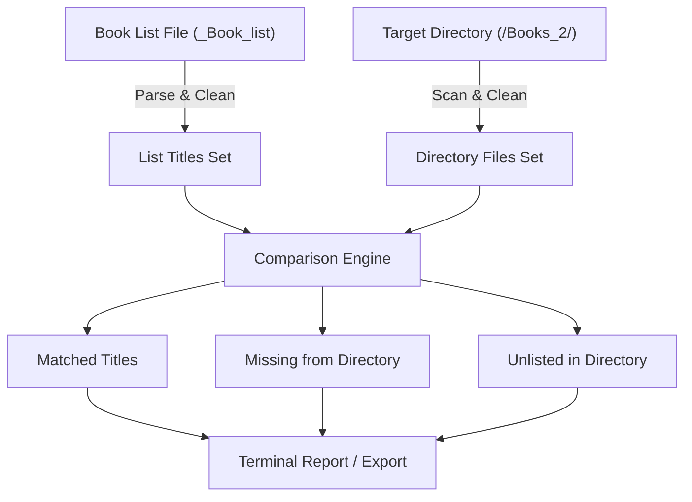

# Requirements

### Overview & Goals
Provide a robust comparison tool that compares a given book list (e.g., `_Book_list`) against the actual files found in a target directory (e.g., `/Volumes/Drive2/Books_2/` or a custom directory). The tool identifies matches, missing files, and unlisted directory files to help organize and verify book collections.

### Scope
- **In Scope**:
  - Reading and cleaning titles from a specified text file (`_Book_list`).
  - Scanning and extracting file titles from a specified directory.
  - Normalizing titles (extensions, whitespace, punctuation/casing) for accurate matching.
  - Categorizing results into:
    - **Matched**: Titles in both the list and directory.
    - **Missing from Directory**: Titles in the list but missing on disk.
    - **Unlisted in Directory**: Files in the directory not recorded in the list.
  - Displaying a structured terminal report with summary statistics and breakdown.
  - Optional export of missing/unlisted items to text or JSON.
- **Out of Scope**:
  - Modifying or deleting files in the target directory.
  - Online metadata fetching (author/ISBN scraping from web APIs).

### User Stories
- **As a user**, I want to see which books from my list are already in my books directory so I know which items are downloaded/available.
- **As a user**, I want a list of missing books so that I know what titles I still need to obtain.
- **As a user**, I want to see unlisted files in the directory so I can update my master book list.

# Technical Design

### Current Implementation
- `books.py` currently loads titles from `_Book_list` or a directory and inserts them into SQLite (`books.db`).
- `title_cleaner.py` provides basic cleaning (`Path(raw).stem.strip()`).
- `_Book_list` contains 900+ raw book entries.

### Key Decisions
- **Matching Strategy**: Use normalized key matching (case-insensitive, extension-stripped, punctuation-trimmed) while preserving raw title representations for display and export.
- **Modular CLI Tool**: Implement comparison logic in a dedicated module `compare_books.py` (or integrable into `books.py`) with configurable file and directory path arguments.
- **Output Formats**: Human-readable console summary table/breakdown by default, with optional file export for missing or unlisted books.

### Architecture & Data Flow



### Components & File Structure
- **`compare_books.py`** (New/Updated module):
  - `load_list_titles(file_path)`: Reads lines, skips comments/empty lines, sanitizes titles.
  - `load_directory_titles(dir_path)`: Scans folder, sanitizes filenames.
  - `compare_sources(list_records, dir_records)`: Computes intersection, difference (missing), and reverse difference (unlisted).
  - `generate_report(...)`: Prints formatted comparison metrics and breakdowns.
  - `main()`: CLI entry point supporting optional `--list`, `--dir`, and `--export` arguments.

### Data Models / Contracts

```python
from dataclasses import dataclass
from typing import Dict, List, Set

@dataclass
class BookRecord:
    clean_title: str
    raw_title: str
    source_path: str

@dataclass
class ComparisonResult:
    total_list_items: int
    total_dir_items: int
    matched: List[BookRecord]
    missing_from_dir: List[BookRecord]
    unlisted_in_dir: List[BookRecord]
```

# Delivery Steps

### ✓ Step 1: Implement book title comparison logic and dataset matching
A comparison module `compare_books.py` (or comparison utility functions) is implemented to calculate set differences and matches between the list file and directory entries.

- Implement title extraction and sanitization helpers for both text file sources (`_Book_list`) and filesystem directories.
- Implement comparison logic returning categorized sets:
  - `in_both`: Titles present in both the list and the directory.
  - `missing_from_directory`: Titles present in the list but not found in the directory.
  - `unlisted_in_directory`: Files present in the directory but absent from the list.
- Add normalization routines (stemming, casing, whitespace stripping, punctuation cleanup) to ensure accurate matching across slight formatting variances.

### ✓ Step 2: Add CLI reporting, export options, and database integration
The user can run comparisons via CLI, view formatted summary statistics and detailed lists, and optionally export comparison reports.

- Build a formatted CLI output showing total counts, match rates, and detailed breakdowns of missing vs. extra titles.
- Add support for command-line arguments (custom list path, target directory path, optional report output file, and verbose mode).
- Provide export capability (e.g., generating `missing_books.txt` or JSON summaries) and integrate with SQLite database tracking if records need to be tagged by availability.