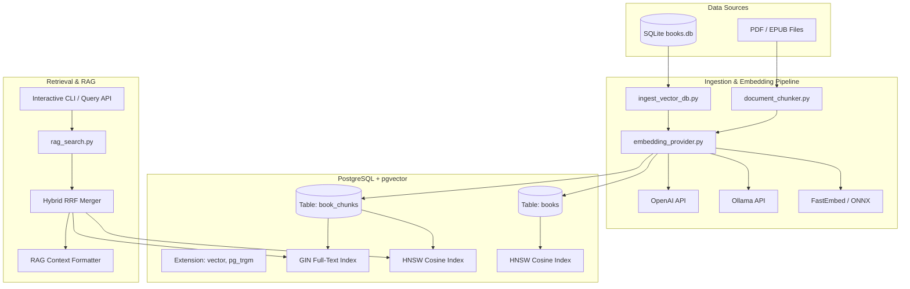

# Requirements

### Overview & Goals
Integrate PostgreSQL with the `pgvector` extension to transform the `home_cc` media and book library into a high-performance vector database and Retrieval-Augmented Generation (RAG) search platform. This enables semantic natural language search, hybrid keyword+vector discovery, and context retrieval across the 26-column catalog metadata and document page contents.

### Scope
- **In Scope**:
  - **Docker Compose Setup**: Self-contained `pgvector/pgvector:pg16` container with local persistent data volume, healthchecks, and environment configuration.
  - **Hierarchical Two-Tier Schema**:
    1. `books` table: Catalog-level semantic vector embeddings (summaries, topics, concepts, taxonomy) for macro book discovery.
    2. `book_chunks` table: Granular page-level and chapter-level text chunk embeddings for micro passage search and RAG citations.
  - **Multi-Backend Embedding Engine**: Pluggable provider architecture supporting **Local FastEmbed (ONNX)**, **Local Ollama**, and **Cloud APIs (OpenAI / Azure)**.
  - **Document Chunking & Ingestion**: Extracting text from PDF (via `pypdf`) and EPUB files, chunking with sliding window and page tracking, and bulk ingesting with progress tracking.
  - **Hybrid Search & RAG Retrieval**: Dense vector cosine similarity + Sparse PostgreSQL `tsvector` with Reciprocal Rank Fusion (RRF), metadata filtering, and RAG context formatting.
  - **CLI & Python API**: Rich CLI commands for database provisioning, ingestion, and search.
- **Out of Scope**:
  - Direct web frontend UI (Streamlit/React UI integration planned for a subsequent phase).
  - OCR extraction for pure scanned image PDFs without embedded text layers.

### User Stories
- **As a researcher/user**, I want to search for conceptual questions (e.g. *"How do transformers implement cross-attention?"*) and retrieve the exact book titles, chapter excerpts, and page numbers.
- **As an ML developer**, I want to export or query vector embeddings with metadata filters (e.g. `domain='Computer Science'`, `published >= 2023`) to feed LLM context windows.
- **As a system administrator**, I want a single command (`docker compose up -d`) to run PostgreSQL with `pgvector` and an automated ingestion script to sync SQLite data into Postgres.

### Functional Requirements
- **FR-1**: Automated PostgreSQL schema provisioning with `vector` and `pg_trgm` extensions.
- **FR-2**: HNSW (Hierarchical Navigable Small World) indexing on vector columns for low-latency similarity queries.
- **FR-3**: Support for configurable embedding providers selectable via `.env` or CLI (`--provider fastembed|ollama|openai`).
- **FR-4**: Sliding window chunker preserving document title, file path, section name, and exact page number.
- **FR-5**: Hybrid search combining dense cosine similarity and sparse keyword matching with Reciprocal Rank Fusion (RRF).
- **FR-6**: Metadata-filtered queries (by domain, subject, author, publication year, media type).
- **FR-7**: RAG context builder formatting retrieved chunks with citations for LLM prompt consumption.

### Non-Functional Requirements
- **Performance**: Sub-50ms query latency for hybrid vector search across tens of thousands of chunks using HNSW indexing.
- **Reliability & Portability**: Fully containerized Docker Postgres service; offline fallback support using local FastEmbed when no network or API keys are present.
- **Extensibility**: Clean abstraction layer for adding new embedding backends or document format parsers.

# Technical Design

### Current Implementation
- SQLite database `books.db` contains 756 records with a 26-column taxonomy schema (`clean_title`, `subtitle`, `author`, `publisher`, `domain`, `subject`, `topics`, `key_concepts`, `summary`, etc.).
- `front_matter.py` provides PDF inspection via `pypdf` and EPUB parsing via `zipfile` for metadata extraction.
- Python 3.13/3.14 virtual environment with `pypdf`, `pandas`, `titlecase`, `wordninja`.

### Key Decisions
1. **Containerized pgvector via Docker Compose**: Uses `pgvector/pgvector:pg16` to guarantee extension availability and consistent indexing without host package dependencies.
2. **Hierarchical Two-Tier Indexing**:
   - **Catalog Level (`books`)**: Embeds structured metadata (`clean_title`, `domain`, `subject`, `topics`, `summary`) for quick book-level identification.
   - **Passage Level (`book_chunks`)**: Embeds 512-token overlapping text chunks extracted from physical files with page citations for deep RAG synthesis.
3. **Pluggable Multi-Backend Embeddings**: An abstract `BaseEmbeddingProvider` allowing seamless switching between local FastEmbed (default, 0-cost, 384-dim ONNX `bge-small-en-v1.5`), Ollama (`nomic-embed-text` / `bge-m3`), and OpenAI (`text-embedding-3-small`, 1536-dim).
4. **Hybrid Retrieval with RRF**: Combines dense vector similarity with PostgreSQL's built-in `tsvector` / `GIN` full-text search using Reciprocal Rank Fusion for high search recall.
5. **HNSW Vector Indexing**: Creates HNSW index (`USING hnsw (embedding vector_cosine_ops)`) for fast approximate nearest neighbor (ANN) retrieval.

### Architecture Diagram


### PostgreSQL Database Schema
```sql
CREATE EXTENSION IF NOT EXISTS vector;
CREATE EXTENSION IF NOT EXISTS pg_trgm;

-- 1. Books Catalog Table
CREATE TABLE IF NOT EXISTS books (
    id SERIAL PRIMARY KEY,
    sqlite_id INTEGER UNIQUE,
    clean_title TEXT NOT NULL,
    subtitle TEXT,
    raw_title TEXT,
    author TEXT,
    publisher TEXT,
    published TEXT,
    edition TEXT,
    language TEXT DEFAULT 'en',
    domain TEXT,
    subject TEXT,
    subfield TEXT,
    genre TEXT,
    topics TEXT,
    key_concepts TEXT,
    target_audience TEXT,
    media_type TEXT,
    summary TEXT,
    file_type TEXT,
    file_extension TEXT,
    source_path TEXT,
    in_directory INTEGER DEFAULT 0,
    metadata_embedding vector(384),
    created_at TIMESTAMP DEFAULT CURRENT_TIMESTAMP,
    updated_at TIMESTAMP DEFAULT CURRENT_TIMESTAMP
);

-- 2. Granular Passage Chunks Table
CREATE TABLE IF NOT EXISTS book_chunks (
    id BIGSERIAL PRIMARY KEY,
    book_id INTEGER NOT NULL REFERENCES books(id) ON DELETE CASCADE,
    chunk_index INTEGER NOT NULL,
    page_number INTEGER,
    section_title TEXT,
    content TEXT NOT NULL,
    token_count INTEGER,
    embedding vector(384) NOT NULL,
    tsv tsvector GENERATED ALWAYS AS (to_tsvector('english', content)) STORED,
    created_at TIMESTAMP DEFAULT CURRENT_TIMESTAMP
);

-- Indexes
CREATE INDEX IF NOT EXISTS idx_books_meta_embedding ON books USING hnsw (metadata_embedding vector_cosine_ops);
CREATE INDEX IF NOT EXISTS idx_chunks_embedding ON book_chunks USING hnsw (embedding vector_cosine_ops);
CREATE INDEX IF NOT EXISTS idx_chunks_tsv ON book_chunks USING gin (tsv);
CREATE INDEX IF NOT EXISTS idx_chunks_book_id ON book_chunks (book_id);
```

### File Structure
```
home_cc/
├── docker-compose.yml           # PostgreSQL + pgvector service definition
├── .env.example                 # Config template for DB credentials & embeddings
├── requirements.txt             # Added psycopg[binary], pgvector, fastembed
├── pg_vector_db.py              # PostgreSQL schema, pool management, migrations
├── embedding_provider.py        # Pluggable embeddings (FastEmbed, Ollama, OpenAI)
├── document_chunker.py          # PDF/EPUB page text extractor and token chunker
├── ingest_vector_db.py          # Batch vectorizer and database synchronizer
├── rag_search.py                # Hybrid search engine, RRF ranker, and RAG CLI
├── test_pg_vector.py            # Unit tests for PostgreSQL connectivity & schema
├── test_embedding_provider.py   # Unit tests for multi-provider embeddings
├── test_document_chunker.py     # Unit tests for text chunking and page citations
└── test_rag_search.py           # Unit tests for hybrid search and context building
```

# Testing

### Validation Approach
Automated testing will be executed against the Python test suite, local embedding providers, and PostgreSQL database container to ensure end-to-end reliability.

### Key Scenarios
1. **Docker & Schema Provisioning**:
   - Verify `docker-compose.yml` launches `postgres-vector` and healthcheck passes.
   - Run `pg_vector_db.py --init` and verify `vector` and `pg_trgm` extensions are installed and tables/indexes are created.
2. **Embedding Providers**:
   - Validate `FastEmbedProvider` generates correct 384-dimensional normalized vectors locally without network access.
   - Validate `OllamaEmbeddingProvider` and `OpenAIEmbeddingProvider` handle batch embedding and connection retry loops gracefully.
3. **Document Extraction & Chunking**:
   - Extract sample PDF and EPUB files, verifying chunk size, overlap boundaries, and page number integrity.
4. **Data Ingestion & Indexing**:
   - Ingest catalog records from `books.db` into PostgreSQL `books` table with metadata embeddings.
   - Ingest sample document chunks into `book_chunks` and confirm HNSW index builds cleanly.
5. **Hybrid Search & RAG Retrieval**:
   - Execute dense vector search queries with cosine similarity ranking.
   - Execute full-text `tsvector` queries and hybrid RRF merge.
   - Validate metadata filtering (e.g., search within `domain = 'Engineering & Applied Physics'`).
   - Validate RAG context prompt output includes book title, author, page number, and formatted excerpts.

### Edge Cases
- Missing or non-existent PDF files: Ingestion skips missing files with warning without aborting batch processing.
- PDFs without text layers (scanned images): Safely detected and logged without throwing unhandled exceptions.
- Empty search queries or queries without matches: Graceful empty result set with helpful suggestions.
- Dynamic vector dimensions: Schema adapts or warns if switching between 384-dim (FastEmbed) and 1536-dim (OpenAI) models.

# Delivery Steps

### ✓ Step 1: Provision Docker pgvector and Schema Management
Provision a containerized PostgreSQL instance with the pgvector extension and establish database migration tools.

- Create `docker-compose.yml` defining the `postgres-vector` service using `pgvector/pgvector:pg16` with volume persistence, healthchecks, and exposed port 5432.
- Create `.env.example` and environment loader configuration for connection strings, provider keys, and vector dimensions.
- Implement `pg_vector_db.py` to manage connection pooling via `psycopg[binary]`, schema creation, extension loading (`vector`, `pg_trgm`), HNSW indexing, and table migrations for `books` and `book_chunks`.
- Add unit tests for database initialization, schema provisioning, and connection error handling.

### ✓ Step 2: Implement Multi-Backend Embedding Engine
A unified, pluggable embedding interface supporting FastEmbed (local ONNX), Ollama, and OpenAI/Cloud backends with dimension auto-detection and caching.

- Implement `embedding_provider.py` defining `BaseEmbeddingProvider` with batch embedding and dimension discovery interfaces.
- Build `FastEmbedProvider` using ONNX runtime (`BAAI/bge-small-en-v1.5`, 384 dimensions) for zero-configuration, zero-cost local CPU/GPU execution.
- Build `OllamaEmbeddingProvider` for local REST-based Ollama models (`nomic-embed-text`, `bge-m3`) with retry logic and connection testing.
- Build `OpenAIEmbeddingProvider` supporting OpenAI/Azure OpenAI embedding models (`text-embedding-3-small`, 1536 dimensions).
- Implement an embedding cache layer to avoid redundant API or model calls.
- Add unit tests in `test_embedding_provider.py` validating each provider interface, batching, and fallback handling.

### ✓ Step 3: Build Document Chunking and Vector Ingestion Pipeline
Extract full text from PDF and EPUB files, segment into overlapping semantic chunks with page citations, and bulk index into Postgres.

- Implement `document_chunker.py` to extract page-indexed text from PDFs (via `pypdf`), EPUB chapters, and text/markdown files.
- Implement token-aware sliding window chunking with configurable chunk sizes (e.g., 512–1024 tokens) and overlap (e.g., 64–128 tokens) retaining page and section metadata.
- Implement `ingest_vector_db.py` to migrate catalog records from SQLite `books.db` into PostgreSQL `books`, generate book-level semantic metadata vectors, and chunk/embed document bodies in parallel worker batches.
- Add CLI arguments for batch size, workers, chunk limits, and directory filters with progress reporting.
- Add unit tests in `test_document_chunker.py` and `test_ingestion.py`.

### ✓ Step 4: Implement Hybrid Search and RAG Retrieval Engine
A hybrid search and RAG synthesis engine combining dense vector HNSW search with sparse tsvector keyword search and prompt formatting.

- Implement `rag_search.py` providing dense vector cosine similarity search, sparse full-text search (`tsvector` / `tsquery`), and Reciprocal Rank Fusion (RRF) for hybrid retrieval.
- Add metadata filtering by `domain`, `subject`, `author`, `published`, and `media_type`.
- Implement hierarchical retrieval: matching top-level books first, followed by relevant page-level passages.
- Implement RAG context assembly and prompt synthesis formatting for downstream LLM generation (Ollama, OpenAI, or local models).
- Build an interactive CLI tool (`python rag_search.py --query ... --hybrid --top-k 5 --synthesize`) with formatted terminal tables and citation previews.
- Add integration and unit tests in `test_rag_search.py`.