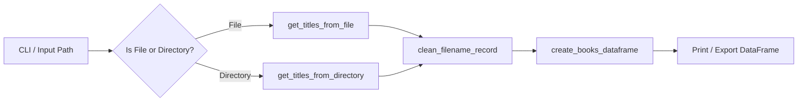

# Requirements

### Overview & Goals
The goal of this refactoring is to transform `title_cleaner.py` into a clean, maintainable, modular, and idiomatic Python script aligned with the **Home Central Command** book data pipeline. 

Based on the specifications and real-world messy dataset in `Home_CC central command.md`, the cleaning logic needs to handle:
- Leading symbols and emojis (e.g., `📂`, `📄`).
- Web/source bracket tags (e.g., `[ WebToolTip.com ]`, `[FreeCourseLab.com]`).
- Redundant duplicate/preview markers (e.g., `(1)`, ` 2`, `_preview`).
- Double extensions (e.g., `.pdf.pdf`).
- Escaped Markdown characters (e.g., `\!`, `\+`, `\-`).
- Underscores and hyphens replaced with single spaces, formatted with proper Title Casing.
- Production of a structured pandas DataFrame with columns `["Original Filename", "Cleaned Title", "Extension"]` for inspection and future SQLite / metadata integration.

### Scope
- **In Scope**:
  - Eliminate top-level side effects (running queries and printing on import).
  - Resolve runtime bugs (undefined `DEFAULT_DIRECTORY`, invalid default argument `directory_path: Path = book_data`).
  - Standardize on `pathlib.Path` and regular expressions for robust sanitization.
  - Implement comprehensive title cleaning rules specified in `Home_CC central command.md`.
  - Provide pure transformation functions (`clean_filename_record`, `create_books_dataframe`).
  - Provide file and directory readers with graceful error handling.
  - Implement a CLI interface (`main()`) with optional target path argument and fallbacks (`_Book_list` -> `DEFAULT_DIRECTORY`).
- **Out of Scope**:
  - Modifying external database schemas or other standalone scripts (`books.py`, `compare_books.py`).

### Functional Requirements
- **FR-1: Enhanced Title Sanitization (`clean_filename_record`)**:
  - Extract the true file extension (handling multi-dot cases like `.pdf.pdf`).
  - Remove leading emojis/symbols (e.g., `📂`, `📁`, `📄`, `_`, `-`, `*`, `•`).
  - Strip bracketed web/source prefixes (e.g., `[ WebToolTip.com ]`).
  - Strip trailing preview/copy suffixes (e.g., `_preview`, ` (1)`, ` 2`).
  - Clean escaped characters (`\!`, `\+`, `\-` -> `!`, `+`, `-`).
  - Replace `_` and `-` with spaces, collapse consecutive whitespace, and apply Title Case.
  - Return a dictionary record with keys `Original Filename`, `Cleaned Title`, and `Extension`.
- **FR-2: DataFrame Generation (`create_books_dataframe`)**:
  - Convert an iterable of raw filenames into a structured pandas DataFrame.
  - Filter out blank lines and comment lines (starting with `#`).
- **FR-3: File & Directory Ingestion (`get_titles_from_file`, `get_titles_from_directory`)**:
  - Read lines from a text list file (e.g., `_Book_list`) or list entries from a directory.
  - Return clean lists of raw filenames.
- **FR-4: CLI Orchestration (`main`)**:
  - Accept an optional path argument via CLI (`sys.argv[1]`).
  - Fall back to `_Book_list` if present, then `DEFAULT_DIRECTORY`.
  - Process entries and output the formatted DataFrame table.
- **FR-5: Safe Importability**:
  - Module can be imported by other scripts or notebooks (`test.ipynb`) without running side-effects or printing.

### Non-Functional Requirements
- **PEP 8 & Type Hints**: Strict adherence to typing annotations (`Iterable`, `List`, `Dict`, `Path`).
- **Robustness**: Graceful error handling for missing files or invalid directory paths.

# Technical Design

### Current Implementation & Code Smells
1. **Top-Level Side Effects**: Lines 10–35 run immediately upon importing `title_cleaner.py`, attempting to read a hardcoded machine-specific path (`/Users/sonic.design/.../_Book_list.txt`).
2. **Runtime NameError**: In `main()`, `DEFAULT_DIRECTORY` is referenced, but its definition on line 6 is commented out (`##DEFAULT_DIRECTORY = ...`).
3. **Invalid Default Parameter**: In `get_titles(directory_path: Path = book_data)`, `book_data` is used as a default argument, which fails at runtime when called without parameters.
4. **Simplistic Cleaning**: The existing implementation only replaces `_` and `-`, missing edge cases shown in `Home_CC central command.md` (emojis, bracket tags, double extensions, preview suffixes, escaped markdown).
5. **Mixed Path Handling**: Uses both `os.path.splitext` and `pathlib.Path`.

### Sanitization Strategy
1. **Extension Extraction**:
   - Strip known double extensions (e.g., `.pdf.pdf` -> `.pdf`).
   - Standardize extensions to lowercase.
2. **String Cleaning Pipeline**:
   - Unescape markdown characters (e.g., `\!` -> `!`, `\+` -> `+`, `\-` -> `-`).
   - Remove leading symbol/emoji prefixes using `^[📂📁📄\-_*•\s]+`.
   - Remove bracketed source tags like `^\[[^\]]+\]\s*`.
   - Remove trailing duplicate/preview markers like `_preview` or `\s+\(\d+\)$`.
   - Replace separators (`_`, `-`) with single spaces.
   - Condense multiple spaces into a single space and apply `.strip().title()`.

### Architecture & Data Flow


### Proposed Code Implementation
```python
from pathlib import Path
from typing import Any, Dict, Iterable, List, Optional
import re
import sys
import pandas as pd

DEFAULT_DIRECTORY = Path("/Volumes/Drive2/Books_2/")
DEFAULT_BOOK_LIST = Path("_Book_list")

# Regex patterns for cleaning titles

EMOJI_SYMBOL_PREFIX = re.compile(r"^[📂📁📄\-_*•\s]+")
BRACKET_PREFIX = re.compile(r"^\[[^\]]+\]\s*")
PREVIEW_OR_COPY_SUFFIX = re.compile(r"(_preview|\s*\(\d+\)|\s+\d+)$", re.IGNORECASE)
DOUBLE_EXT_PATTERN = re.compile(r"(\.[a-zA-Z0-9]+)\1+$")


def extract_extension_and_stem(raw_name: str) -> tuple[str, str]:
    """Extracts the base stem and standardized lowercase extension, handling double extensions."""
    text = raw_name.strip()
    # Handle double extensions like .pdf.pdf
    text = DOUBLE_EXT_PATTERN.sub(r"\1", text)
    path = Path(text)
    extension = path.suffix.lower()
    stem = path.stem if extension else text
    return stem, extension


def clean_filename_record(raw_name: str) -> Dict[str, str]:
    """
    Parses and sanitizes a filename according to Home Central Command rules.
    Returns a dictionary with 'Original Filename', 'Cleaned Title', and 'Extension'.
    """
    raw_str = raw_name.strip()
    stem, extension = extract_extension_and_stem(raw_str)

    # 1. Unescape markdown formatting characters
    cleaned = stem.replace(r"\!", "!").replace(r"\+", "+").replace(r"\-", "-")

    # 2. Strip leading emojis and symbols
    cleaned = EMOJI_SYMBOL_PREFIX.sub("", cleaned)

    # 3. Strip bracketed web/source tags (e.g., [ WebToolTip.com ])
    cleaned = BRACKET_PREFIX.sub("", cleaned)

    # 4. Strip duplicate copy numbers or preview tags
    cleaned = PREVIEW_OR_COPY_SUFFIX.sub("", cleaned)

    # 5. Replace separators with spaces and collapse whitespace
    cleaned = cleaned.replace("_", " ").replace("-", " ")
    cleaned = re.sub(r"\s+", " ", cleaned).strip()

    # 6. Apply title case formatting
    cleaned_title = cleaned.title() if cleaned else stem

    return {
        "Original Filename": raw_name,
        "Cleaned Title": cleaned_title,
        "Extension": extension,
    }


def create_books_dataframe(filenames: Iterable[str]) -> pd.DataFrame:
    """Converts a collection of raw filenames into a structured pandas DataFrame."""
    records = [
        clean_filename_record(name)
        for name in filenames
        if name and not name.strip().startswith("#")
    ]
    return pd.DataFrame(records)


def get_titles_from_file(file_path: Path) -> List[str]:
    """Reads raw title strings from a line-separated text file."""
    path = Path(file_path)
    if not path.is_file():
        print(f"Error: File not found at '{path}'.")
        return []
    return path.read_text(encoding="utf-8", errors="ignore").splitlines()


def get_titles_from_directory(directory_path: Path) -> List[str]:
    """Retrieves file names from the specified directory if it exists."""
    target_dir = Path(directory_path)
    if not target_dir.is_dir():
        print(f"Error: '{target_dir}' is not a valid directory.")
        return []
    return [entry.name for entry in target_dir.iterdir() if entry.is_file()]


def load_titles(source_path: Path) -> List[str]:
    """Loads titles from either a file or directory based on source path type."""
    if source_path.is_file():
        return get_titles_from_file(source_path)
    return get_titles_from_directory(source_path)


def main() -> None:
    """Main CLI entry point."""
    if len(sys.argv) > 1:
        target_path = Path(sys.argv[1])
    elif DEFAULT_BOOK_LIST.exists():
        target_path = DEFAULT_BOOK_LIST
    else:
        target_path = DEFAULT_DIRECTORY

    print(f"Loading titles from: '{target_path}'")
    raw_titles = load_titles(target_path)

    if not raw_titles:
        print("No files found to process.")
        return

    df = create_books_dataframe(raw_titles)
    print(f"Processed {len(df)} title(s):\n")
    print(df)


if __name__ == "__main__":
    main()
```

# Delivery Steps

### ✓ Step 1: Implement robust title cleaning and DataFrame transformation logic
Pure transformation functions (`clean_filename_record`, `create_books_dataframe`, `extract_extension_and_stem`) are implemented with regex-based sanitization and zero import-time side-effects.

- Implement regex patterns for stripping emojis/symbols, bracketed web tags (`[ WebToolTip.com ]`), duplicate/preview suffixes (`_preview`, `(1)`), and double extensions (`.pdf.pdf`).
- Define `clean_filename_record(raw_name: str) -> dict[str, str]` to return structured records with `Original Filename`, `Cleaned Title`, and `Extension`.
- Implement `create_books_dataframe(filenames: Iterable[str]) -> pd.DataFrame` to build formatted DataFrames from raw title collections.
- Remove all top-level side effects, hardcoded absolute paths, and redundant/broken functions.

### ✓ Step 2: Implement source input handlers and CLI entry point
Robust file and directory loaders with CLI argument orchestration are implemented with fallback handling and entry-point guards.

- Define configuration constants `DEFAULT_BOOK_LIST = Path("_Book_list")` and `DEFAULT_DIRECTORY = Path("/Volumes/Drive2/Books_2/")`.
- Implement `get_titles_from_file(file_path: Path) -> list[str]` and `get_titles_from_directory(directory_path: Path) -> list[str]` with path validation.
- Implement unified `load_titles(source_path: Path) -> list[str]` and `main()` entry point with `sys.argv` support.
- Protect execution under `if __name__ == "__main__":` to ensure safe module imports.